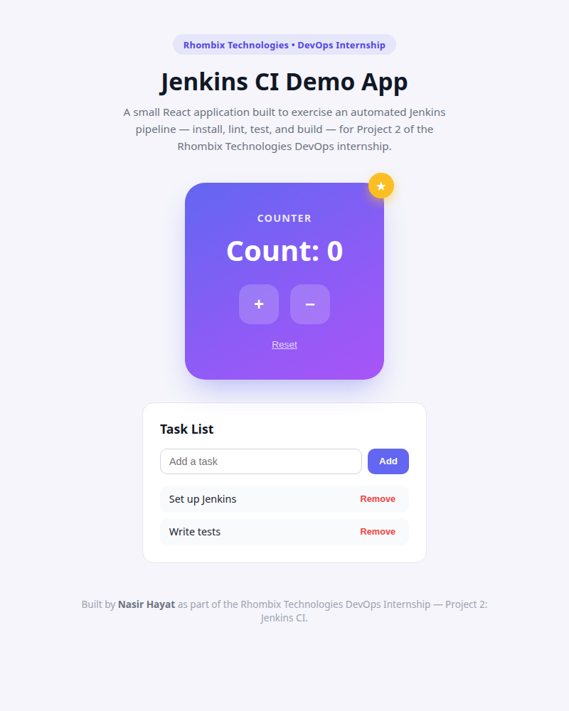

# Project 2 — Jenkins CI (Sample React App)

## About

This is my submission for **Project 2** of the **Rhombix Technologies DevOps
internship**. It provides a small, testable **React application** used as the build/test
target for a Jenkins CI pipeline. The goal isn't the app itself — it's demonstrating a
working CI flow end-to-end: install dependencies, lint, run automated tests, and produce
a production build, all driven by a Jenkins declarative pipeline.

## App Preview



The UI is a small counter + task list demo: a gradient counter card with increment,
decrement, and reset controls, and a task list card for adding/removing items — styled
to look presentable while staying simple enough to reason about in a CI context.

## What's Included

- **`react-app/`** — a Vite + React app with:
  - A simple UI (counter + task list) in [`src/App.jsx`](react-app/src/App.jsx)
  - Automated tests using **Vitest** + **React Testing Library** in
    [`src/App.test.jsx`](react-app/src/App.test.jsx)
- **`Jenkinsfile`** — a declarative Jenkins pipeline with `Install → Lint → Test → Build`
  stages, pointed at `react-app/`.
- **`docs/`** — a screenshot of the running app, used above.

## Running Locally

```bash
cd react-app
npm install
npm run dev       # start the dev server
npm run test      # run the automated test suite
npm run build     # production build (output in dist/)
```

## Test Coverage

The test suite in [`App.test.jsx`](react-app/src/App.test.jsx) covers:

- The app renders its main heading
- The counter increments, decrements, and resets correctly
- The seeded tasks render on load
- A new task can be added via the input form
- A task can be removed from the list

## Jenkins Pipeline

The [`Jenkinsfile`](Jenkinsfile) defines a pipeline that:

1. Checks out the repository
2. Installs dependencies with `npm ci`
3. Lints the source with `npm run lint`
4. Runs the test suite with `npm run test`
5. Builds a production bundle with `npm run build`

Point a Jenkins **Pipeline** job (or a **Multibranch Pipeline**) at this repository with
the Jenkinsfile path set to `Project-2-Jenkins-CI/Jenkinsfile`, and ensure a NodeJS tool
named `NodeJS` is configured under **Manage Jenkins → Tools**.

## Internship Context

This project extends my work for the **Rhombix Technologies internship** (DevOps
track). Alongside the required submission ([Project 1 — Linux
Fundamentals](../Project-1-Linux-Fundamentals/)), I built this Jenkins CI pipeline as
additional, self-driven practice with the DevOps/CI tooling the internship is centered
around.

## Author

**Nasir Hayat** ([@nasirhayat028](https://github.com/nasirhayat028))
